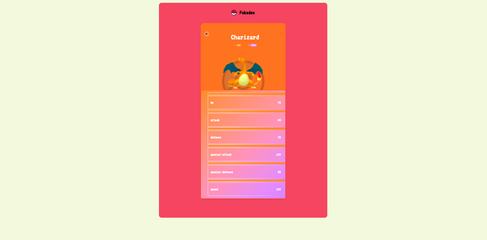

# 🎮 Pokédex App

A simple and responsive web application that displays the first 151 Pokémon from the original generation. It uses the [PokéAPI](https://pokeapi.co/) to fetch Pokémon data including their name and official artwork.

<p align="center">
  
</p>
<br>
<p align="center">
  
</p>


## 🔗 Live Demo

Check out the live project here:  
👉 [GitHub Pages Link](https://Gustavo-Zamai.github.io/poke-api-client)


---

## 🚀 Technologies Used

- HTML
- CSS
- JavaScript
- [API](https://pokeapi.co/)

---

## 📁 Project Structure

```bash
poke-api-client/
├── index.html
├── 404.html
├── assets/
│  ├── css/
│   ├── global.css
│   ├── pokedex.css
│   └── pokemon.css
│  ├── images/
│   ├── back.svg
│   ├── background.png
│   ├── favicon.png
│   └── image.png
│  ├── js/
│   ├── main.js
│   ├── poke-api.js
│   └── pokemon-model.js
└── README.md
```

## ⚙️ How to Run Locally
#### 1. Clone the repository:

```bash
git clone https://github.com/Gustavo-Zamai/poke-api-client.git
```
#### 2. Navigate to the project folder:

```bash
cd poke-api-client
```
#### 3. Open index.html in your browser:

```bash
start index.html      # On Windows
# or
open index.html       # On macOS
# or
xdg-open index.html   # On Linux
# No installation required — it's a fully static front-end game!
```


## 🧾 Features
Pagination through Pokémon list (limited to Gen 1 - 151).

Fetches and displays Pokémon names and official images.

Clean and responsive layout.


## 📌 API Reference
PokéAPI

## 📄 License
This project is licensed under the MIT License.

## 🙋‍♂️ Author
#### Gustavo Zamai

[LinkedIn](https://www.linkedin.com/in/gustavo-sim%C3%A3o-zamai-664a5521a/) • 
[GitHub](https://github.com/Gustavo-Zamai)